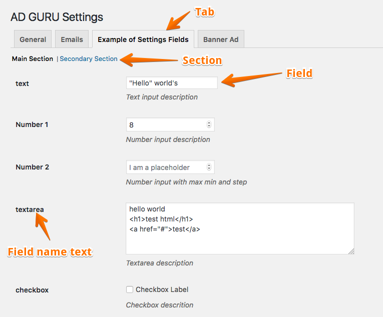

# AdGuru Settings API and Settings Page Documentation

This documentation helps you to play with settings page, setting api and related functions.
**Class :** `ADGURU_Settings`

### Related Terms
- **Settings Page :**  WP admin page that contains all the settings things.
- **Tab :** A tab contains one or more sections.
- **Section :** A section contains one or more fields.
- **Field :** Fields represent the HTML for settings inputs. 

 

To add new **field** you have to use the slug of **tab** and **section** in which you want to show your field. 
Write codes in `ADGURU_Settings` class and its methods.

### Add new Tab
- **Method :** `add_tab( $slug , $text )`
- **Parameters :** 
  * $slug - string - unique text for the tab.
  * $text - string - display text for the tab.

Example:

	$this->add_tab( 'general' , __( 'General', 'adguru' ) ); 

### Add new Section
- **Method :** `add_section( $tab , $slug, $text )`
- **Parameters :** 
  * $tab - string - slug of tab in which you want to show the section.
  * $slug - string -  unique text for the section. Unique among other secions under same tab. A tab can not contain duplicate section but same section slug can be used in differnet tabs.
  * $text - string - display text for the section.

Example:

	$this->add_section( 'general' , 'main',  __( 'General Settings', 'adguru' ) );
*Note : section text and link will not be displayed when the parent tab has only one section*

### Add new field
- **Method :** `add_field( $tab, $section, $field )`
- **Parameters :** 
  * $tab - string - slug of tab in which your section exists.
  * $section - string - slug of section in which you want to show the field
  * $field - array - associative array of options for the field. See the available options below.

Example:

	$this->add_field('example' , 'main', array(
		'type' => 'text',
		'id'   => 'example_text_1',
		'name' => 'Text Input',
        'desc' => __( 'Text input description', 'adguru' ),
        'default' => 'Default value',
        'placeholder' => 'I am a placeholder'
	));

#### Complete Example
	$this->add_tab( 'general' , __( 'General', 'adguru' ) );
	$this->add_section( 'general' , 'main',  __( 'General Settings', 'adguru' ) );
	$this->add_field('example' , 'main', array(
		'type' => 'text',
		'id'   => 'example_text_1',
		'name' => 'Text Input',
        'desc' => __( 'Text input description', 'adguru' ),
        'default' => 'Default value',
        'placeholder' => 'I am a placeholder'
	));

### Add settings from outside of the class `ADGURU_Settings` 
Use the action hook  `adguru_settings_add` to add settings from other modules , extensions or theme functions.

This hook passes `ADGURU_Settings` object to your function. 

Example : 
	
	add_action("adguru_settings_add", 'add_my_settings_fields');
	function add_my_settings_fields( $settings )
	{
		$settings->add_tab( 'general' , __( 'General', 'adguru' ) );
		$settings->add_section( 'general' , 'main',  __( 'General Settings', 'adguru' ) );
		$settings->add_field('example' , 'main', array(
			'type' => 'text',
			'id'   => 'example_text_1',
			'name' => 'Text Input',
	        'desc' => __( 'Text input description', 'adguru' ),
	        'default' => 'Default value',
	        'placeholder' => 'I am a placeholder'
		));
	}

### Available Fields and Options
**All fields may have following options**

- type
- id
- name
- desc
- default
- callback
- sanitize_callback

**Fields List**

| Field Type | Additional Options                          | Description                                         |
|------------|---------------------------------------------|-----------------------------------------------------|
| header     |                                             | Just display heading text                           |
| text       | placeholder, size, readonly                 | Text input field. `<input type="text" />`           |
| password   | placeholder, size, readonly                 | Text input field. `<input type="password" />`       |
| number     | placeholder, size, readonly, max, min, step | Text input field.`<input type="number"/>`           |
| url        | --                                          | Right now this field is same as text field          |
| textarea   | placeholder, size                           | `<textarea>` input field                            |
| editor     | placeholder, size                           | Textarea with  TinyMCE wysiwyg editor               |
| select     | options, size                               | Input type `<select>`                               |
| radio      | options                                     | Input type radio                                    |
| checkbox   | label                                       | Input type checkbox. Value is either 'on' or 'off'  |
| multicheck | --                                          | Multiple checkboxes                                 |
| color      | --                                          | Colorpicker                                         |
| file       | --                                          | Browse and set file url using WP media uploader     | 

### Field options detail

| Option            | Data type         | Required | Description                                                                                                                                                                                                                                               |
|-------------------|-------------------|----------|-----------------------------------------------------------------------------------------------------------------------------------------------------------------------------------------------------------------------------------------------------------|
| type              | string            | Yes      | Type of field                                                                                                                                                                                                                                             |
| id                | string            | Yes      | Unique string for the field. This string is used create unique value of HTML name and id attribute of input field. Also this string the key to  access the field value in settings array.                                                                 |
| name              | string            | No       | This string is shown on the left column of settings field table                                                                                                                                                                                           |
| desc              | string            | No       | Detail text about field. It is shown underneath the input field.                                                                                                                                                                                          |
| default           | mixed             | No       | Default and first time value for the field. Value can be any type data based on the field type.                                                                                                                                                           |
| callback          | string  or array  | No       | Callable function name or  array.  This function will be called to render the output HTML of the field. Use this option to render your own custom type field. Also you can use this to override the display function of built-in field types.             |
| sanitize_callback | string or array   | No       | Callable function name or array. This function will be called to sanitize the input data just before saving. If the input data is not as perfect as expected , you can set the old data and can set an error message using add_settings_error() function. |
| placeholder       | string            | No       | HTML placeholder attribute value for text, number, url and  textarea type fields.                                                                                                                                                                         |
| readonly          | true/false        | No       | Set this option `true` if you want to make the field readonly. User will unable to change value.                                                                                                                                                          |
| size              | string            | No       | Size of input fields. Possible values are `small` , `medium` and `large`                                                                                                                                                                                  |
| label             | string            | No       | Label string for checkbox                                                                                                                                                                                                                                 |
| options           | array             | Yes/No   | Associative array of options of  `select` , `radio` and `multicheck` type field where the array `key` is the option value and  `value` is the display text of option.                                                                                     |
| max               | number            | No       | Maximum value of number field                                                                                                                                                                                                                             |
| min               | number            | No       | Minimum value of number field                                                                                                                                                                                                                             |
| step              | number            | No       | Step value of number field                                                                                                                                                                                                                                |

## Example of all possible types of settings fields

	<?php

	add_action("adguru_settings_add", 'example_settings_fields');

	function example_settings_fields( $settings ) {
		$settings->add_tab( 'example' , __( 'Example of Settings Fields', 'adguru' ) );
		$settings->add_section( 'example' , 'main',  __( 'Main Section', 'adguru' ) );
		$settings->add_section( 'example' , 'secondary',  __( 'Secondary Section', 'adguru' ) );

		$settings->add_field('general' , 'main', array(
			'type' => 'header',
			'id'   => 'header_example_1',
			'name' => '',
			'desc' => '<h3>Just a Heading</h3>',
					
		));

		$settings->add_field('example' , 'main', array(
			'type'  => 'text',
			'id'    => 'example_text_small',
			'name'  => __( 'Small Text Input', 'adguru' ),
	        'desc'  => __( 'Text input description', 'adguru' ),
	        'default' => '',
	        'size'  => 'small'
		));

		$settings->add_field('example' , 'main', array(
			'type'  => 'text',
			'id'    => 'example_text_medium',
			'name'  => __( 'Medium Text Input', 'adguru' ),
	        'desc'  => __( 'Text input description', 'adguru' ),
	        'default' => '',
	        'placeholder' => 'I am a placeholder',
	        'size'  => 'medium'
		));

		$settings->add_field('example' , 'main', array(
			'type'  => 'text',
			'id'    => 'example_text_large',
			'name'  => __( 'Large Text Input', 'adguru' ),
	        'desc'  => __( 'Text input description', 'adguru' ),
	        'default' => '',
	        'placeholder' => 'I am a placeholder',
	        'size'  => 'large'
		));

		$settings->add_field('example' , 'main', array(
			'type' => 'number',
			'id'   => 'example_number_1',
			'name' => 'Number 1',
	        'label'=> __( 'Number Input', 'adguru' ),
	        'desc' => __( 'Number input description', 'adguru' ),
	        'default' => '',
	        'placeholder' => 'I am a placeholder'
		));

		$settings->add_field('example' , 'main', array(
			'type' => 'number',
			'id'   => 'example_number_2',
			'name' => 'Number 2',
	        'label'=> __( 'Number Input', 'adguru' ),
	        'desc' => __( 'Number input with max min and step', 'adguru' ),
	        'max'  =>50,
	        'min'  =>20,
	        'step' =>5,
	        'default' => '',
	        'placeholder' => 'I am a placeholder'
		));

		$settings->add_field('example' , 'main', array(
			'type'    => 'password',
			'id'      => 'example_password_1',
	        'name'   => __( 'Password', 'adguru' ),
	        'desc'    => __( 'Password description', 'adguru' ),
	        'default' => '',
	        'placeholder' => 'Enter password'
		));

		$settings->add_field('example' , 'main', array(
			'type'  => 'textarea',
			'id'    => 'example_textarea_1',
			'name' => __( 'Textarea Input', 'adguru' ),
			'desc'  => __( 'Textarea description', 'adguru' ),
			'placeholder' => 'I am a placeholder'		
		));

		$settings->add_field('example' , 'main', array(
			'type'  => 'checkbox',
			'id'    => 'example_checkbox_1',
			'name'  => __( 'Checkbox', 'adguru' ),
	        'label' => __( 'Checkbox Label', 'adguru' ),
	        'desc'  => __( 'Checkbox descrition', 'adguru' ),		
		));

		$settings->add_field('example' , 'main', array(
			'type' => 'radio',
			'id'   => 'example_radio_1',
	        'name' => __( 'Radio Button', 'adguru' ),
	        'desc' => __( 'A radio button', 'adguru' ),
	        'options' => array(
	            'yes' => 'Yes',
	            'no' => 'No'
	        )	
		));

		$settings->add_field('example' , 'main', array(
			'type'    => 'multicheck',
			'id'      => 'example_multicheck_1',
	        'name'   => __( 'Multile checkbox', 'adguru' ),
	        'desc'    => __( 'Multi checkbox description', 'adguru' ),
	        'options' => array(
	              'one'   => 'One',
	              'two'   => 'Two',
	              'three' => 'Three',
	              'four'  => 'Four'
	        )		
		));

		$settings->add_field('example' , 'main', array(
			'type'    => 'select',
			'id'      => 'example_selectbox_1',
	        'name'   => __( 'A Dropdown selectbox', 'adguru' ),
	        'desc'    => __( 'Dropdown description', 'adguru' ),
	        'default' => 'no',
	        'options' => array(
	             'yes' => 'Yes',
	             'no'  => 'No'
	        )	
		));

		$settings->add_field('example' , 'main', array(
			'type'    => 'file',
			'id'      => 'example_file_1',
	        'name'   => __( 'File', 'adguru' ),
	        'desc'    => __( 'File description', 'adguru' ),
	        'default' => '',
	        'placeholder' => 'Browse a file',
		));

		$settings->add_field('example' , 'main', array(
			'type' 	  => 'editor',
			'id'   	  => 'example_wysiwyg_1',
	        'name'   => __( 'WYSIWYG Editor', 'adguru' ),
	        'desc' 	  => __( 'wysiwyg editor example', 'adguru' ),
	        'default' => ''	
		));

		$settings->add_field('example' , 'main', array(
			'type'    => 'color',
			'id'      => 'example_color_1',
	        'name'   => __( 'Color', 'adguru' ),
	        'desc'    => __( 'Color description', 'adguru' ),
	        'default' => ''	
		));

		$settings->add_field('example' , 'secondary', array(
			'type'  => 'text',
			'id'    => 'example_text_2',
			'name'  => __( 'Text Input', 'adguru' ),
	        'desc'  => __( 'Text input description', 'adguru' ),
	        'default' => 'Title 2',
	        'placeholder' => 'I am a placeholder'
		));

		$settings->add_field('example' , 'secondary', array(
			'type'    => 'color',
			'id'      => 'example_color_2',
	        'name'   => __( 'Color', 'adguru' ),
	        'desc'    => __( 'Color description', 'adguru' ),
	        'default' => '#CFEE00'	
		));

	}//end function example...

	?>

## Custom Field Type and Custom Callback

To create custom type of field provide the custom type name through `type` option and also provide the callback funciton name through `callback` option.  
Callback function receives two argument `field_options` and `AdGuru Settings API object`.  
To take value of  `name` , `id` and `value` attributes must use method `get_field_attrs` of `AdGuru Settings API object`.

	<?php

	add_action("adguru_settings_add", 'example_settings_fields');

	function example_settings_fields( $settings ) {
		
		$settings->add_field("banner-ad", "main", array(
			'type' => 'my_custom_type',
			'id'   => 'my_custom_field',
			'name' => __( 'My Custom Field', 'adguru' ),
			'desc' => __( 'Custom type field', 'adguru' ),
			'default'  => '',
			'callback' => 'custom_field_callback'

		));

	}

	function custom_field_callback( $args , $settings_api )
	{
		$attrs = $settings_api->get_field_attrs( $args );
		$name = $attrs['name'];
		$id = $attrs['id'];
		$value = $attrs['value'];
	    $placeholder = $args['placeholder'] != "" ? ' placeholder="'.$args['placeholder'].'"': '';
	    $html     = '
';
	    $html 	 .= 'This is my custom type field';
	    $html    .= '<input type="text" id="'.esc_attr($id ).'" name="'.esc_attr( $name ).'" value="' . esc_attr( stripslashes( $value ) ) . '"' .$placeholder . '/>';
		$html    .= '<label for="'.esc_attr($attrs['id'] ).'"> '  . $args['desc'] . '</label>';
		$html 	 .= '
';
		echo $html;
	}

	?>

## Retrieve a setting( field ) value from database
**Function :** `adguru_get_option( $key, $default = NULL )`
**Parameters:**

- $key ( required ) - string - field id to retrieve the value for.
- $default (optional ) - mixed - default value for the field.

**Example:**

	<?php
	$my_add_bg_color = adguru_get_option( 'my_ad_bg_color', '#ff0000' );
	?>

## Filter Hooks

### adguru_settings_tabs
Applied to tabs array. Filter function arguments: 1. `$tabs` - array of tabs detail.

### adguru_settings_sections_{$tab}
Applied to section array for specific tab. Filter function arguments: 1. `$sections` - array of sections detail. 

### adguru_settings_sections
Applied to sections array for all tabs. Filter function arguments: 1. `$sections` - array of sections detail. 

### adguru_settings_fields_{$tab}_{$section}
Applied to fields array for a specific section and a tab. Filter function arguments: 1. `$fields` - array of fields detail. 

### adguru_settings_fields
Applied to all fields array. Filter function arguments: 1. `$fields` - array of fields detail. 

### adguru_settings_sanitize
Applied to all inputs array for sanitization. Filter function arguments: 1. `$inputs` - array of inputs. 

### adguru_settings_{$tab}_{$section}_sanitize
Applied to inputs array for sanitization when only fields from a specific section of specific tab are being processed. Filter function arguments: 1. `$inputs` - array of inputs. 

## Action Hooks

### adguru_settings_add
After adding settings fields by main AdGuru. Use this hook to add more settings tabs, sections and fields. Provided arguments : `$settings` - object of `ADGURU_Settings` class.   

### adguru_settings_tab_top
At the beginning of any tab output. Provided arguments : 1. `$active_tab` - slug of current tab, 2. `$active_section` - slug of current section.

### adguru_settings_tab_top_{$tab}_{$section}
At the beginning of output of a specific section of a tab. Provided arguments : none. 

### adguru_settings_tab_bottom_{$tab}_{$section}
At the end of output of a specific section of a tab. Provided arguments : none. 

### adguru_settings_tab_bottom
At the end of any tab output. Provided arguments : 1. `$active_tab` - slug of current tab, 2. `$active_section` - slug of current section.

